# 🚦 Branch-Thinking MCP Tool

[](./CHANGELOG.md)
[](https://github.com/your-org/branch-thinking-mcp/issues)
           

> **What’s New (2025-04):**
>
> - Advanced visualization: clustering (k-means/degree), centrality overlays, edge bundling, and agentic overlays for tasks and priorities
> - Agentic cache & prefetch: LRU+TTL caches for embeddings, summaries, analytics, and proactive agent cache warming
> - Enhanced analytics: real-time, multi-branch, and focusNode support; agent-optimized metadata
> - Upgraded documentation and onboarding for agents and users

---

## Features

- 🌳 **Branch Management:** Create, focus, and navigate multiple lines of thought
- 🔗 **Cross-References:** Link related thoughts across branches (typed, scored)
- 💡 **AI Insights:** Automatic insight and summary generation
- 🧠 **Semantic Search:** Find related thoughts using embeddings
- 📊 **Advanced Visualization:**
  - Node clustering (k-means/degree)
  - Centrality overlays (closeness, betweenness)
  - Edge bundling
  - Task overlays (status, priority, next-action)
  - Agentic overlays and metadata for all nodes/edges
  - FocusNode and multi-branch visualization
- ⚡ **Agentic Cache & Prefetch:**
  - LRU+TTL caches for embeddings, summaries, analytics
  - Proactive cache warming for agent workflows
- 🗂️ **Persistent Storage:** Queryable, extensible, and never lose a thought
- 🔄 **Real-Time & Multi-Branch:** Visualize and analyze multiple branches and nodes in real-time
- 🛠️ **Production-Grade:** Robust error handling, performance optimizations, and agent/human-friendly APIs

---

## 🛠️ Technology Stack

- **Node.js** (18+)
- **TypeScript** (4.x)
- **@dagrejs/graphlib**: Graph structure, algorithms, and analytics
- **ml-kmeans**: Clustering for visualization
- **lru-cache**: LRU+TTL caching for embeddings, summaries, analytics
- **@xenova/transformers**: Embedding and summarization pipelines
- **@modelcontextprotocol/sdk**: MCP protocol and agent integration
- **chalk**: CLI output styling
- **Mermaid**: Gantt/roadmap visualization
- **pnpm**: Fast dependency management

---

## Roadmap (Gantt)

```mermaid
gantt
    title Branch-Thinking MCP Roadmap (2025)
    dateFormat  YYYY-MM-DD
    section Q2 2025
    Advanced Visualization/Analytics :done,      vis1, 2025-04-01,2025-04-20
    Agentic Cache & Prefetch         :done,      cache1, 2025-04-10,2025-04-22
    Enhanced Agentic Docs            :done,      doc1, 2025-04-15,2025-04-25
    Real-time Collaboration          :active,    collab1, 2025-04-20,2025-06-01
    Web Visualization Dashboard      :active,    webviz1, 2025-04-25,2025-06-15
    section Q3 2025
    Plugin System                    :planned,   plugin1, 2025-06-15,2025-07-15
    Mobile/Tablet UI                 :planned,   mobile1, 2025-07-01,2025-08-01
    AI Branch Merging                :planned,   merge1, 2025-07-15,2025-08-15
    Knowledge Base Sync              :planned,   sync1, 2025-08-01,2025-09-01
```

<!-- Only one Gantt chart is present and up-to-date. -->
---

## Table of Contents

- [Why Branch-Thinking?](#why-branch-thinking)
- [Summary](#summary)
- [Features](#features)
- [Quick Start](#quick-start)
- [Getting Started](#getting-started)
- [Real-World Usage Recipes](#real-world-usage-recipes)
- [Architecture & Flow](#architecture--flow)
- [Roadmap (Gantt)](#roadmap-gantt)
- [Testing & Quality](#testing--quality)
- [Security](#security)
- [Accessibility & Internationalization](#accessibility-and-internationalization)
- [Troubleshooting & FAQ](#troubleshooting-and-faq)
- [Best Practices](#best-practices)
- [Contributing](#contributing)
- [Changelog](#changelog)
- [References & Related Projects](#references-and-related-projects)
- [Credits](#credits)
- [License](#license)

---

## Why Branch-Thinking?

- **Agentic by Design:** Built for both human and AI workflows—every command is agent-friendly.
- **True Branching:** Organize, cross-link, and reason over ideas, code, and tasks in parallel.
- **AI-Native:** Semantic search, auto-summarization, and insight generation out-of-the-box.
- **Persistent & Visual:** Never lose a thought—everything is queryable, visualizable, and extensible.

## Summary

> **Branch-Thinking MCP Tool** is an advanced agentic platform for managing, visualizing, and reasoning over branching thoughts, tasks, code, and knowledge. It empowers both AI agents and humans to organize complex projects, cross-link ideas, and automate insight generation using a powerful branch-based paradigm. With semantic search, visualization, and persistent task/code management, it is designed for next-generation collaborative and autonomous workflows.

**Branch-Thinking MCP Tool** is an advanced agentic platform for managing, visualizing, and reasoning over branching thoughts, tasks, code, and knowledge. It empowers both AI agents and humans to organize complex projects, cross-link ideas, and automate insight generation using a powerful branch-based paradigm. With semantic search, visualization, and persistent task/code management, it is designed for next-generation collaborative and autonomous workflows.

---

## Architecture & Flow

```mermaid
flowchart TD
    User([User/Agent 🤖])
    CLI([CLI/API])
    BM[BranchManager 🧠]
    EmbCache[[Embedding/Summary Cache]]
    Storage[(Persistent Storage 💾)]
    Viz([Visualization/Analytics])
    Tasks([Task Extraction])
    Snippets([Code Snippet Storage])

    User-->|Commands/Queries|CLI
    CLI-->|Manage/Query|BM
    BM-->|Cache|EmbCache
    BM-->|Save/Load|Storage
    BM-->|Visualize|Viz
    BM-->|Tasks|Tasks
    BM-->|Snippets|Snippets
    BM-->|Results|CLI
    CLI-->|Output|User
```



---

## Quick Start

Get up and running in seconds:

```bash
pnpm install  # Recommended for speed (or npm install)
pnpm build
node dist/index.js --help  # See available commands
```

---

## Getting Started

### 1. Clone & Install

```bash
git clone https://github.com/your-org/branch-thinking-mcp.git
cd branch-thinking-mcp
pnpm install  # Or npm install
pnpm build   # Or npm run build
```

### 2. Configure (Optional)

For Claude Desktop integration, add to your `claude_desktop_config.json`:

```json
"branch-thinking": {
  "command": "node",
  "args": [
    "/your-custom-mcp-dir-here/branch-thinking/dist/index.js"
  ]
}
```

### 3. Run

```bash
node dist/index.js
```

---

## Real-World Usage Recipes

### 1. Knowledge Capture & Linking

```bash
# Batch capture meeting notes
add-thought dev "Discussed semantic search improvements" note
add-thought dev "Agreed to refactor API" decision
# Link related thoughts
link-thoughts t1 t2 supports "API refactor supports search improvements"
```

### 2. Agentic Task Extraction

```bash
# Extract and manage tasks from a research branch
extract-tasks research
list-tasks research open
update-task-status task-1 in_progress
```

### 3. Visualization for Insight

```bash
# Generate and interpret a knowledge graph
visualize dev
# Review AI-generated summary
summarize-branch dev
```

---

## 🧑‍💻 Live Example: Agentic Workflow

```bash
# 1. Create a new branch for your project or idea
create-branch "AI Research"

# 2. Add thoughts and observations
add-thought [branchId] "Explore semantic search for agent workflows" analysis
add-thought [branchId] "Test cross-linking and summarization" observation

# 3. Link related thoughts
link-thoughts [thoughtId1] [thoughtId2] supports "Thought 2 validates Thought 1"

# 4. See your knowledge graph
visualize [branchId]

# 5. Extract tasks and get AI review
extract-tasks [branchId]
review-branch [branchId]
```

> Replace `[branchId]` and `[thoughtIdX]` with actual IDs from `list` and `history`.

---

## Command Reference

### Branch Management

| Command | Description |
|---------|-------------|
| `list` | Show all branches with status |
| `focus [branchId]` | Switch focus to a branch |
| `history [branchId?]` | Show thought history |
| `summarize-branch [branchId?]` | AI summary of branch |
| `review-branch [branchId?]` | AI review of branch |
| `visualize [branchId?]` | Visual graph of connections |

### Thought & Insight Management

| Command | Description |
|---------|-------------|
| `insights [branchId?]` | Get AI-generated insights |
| `crossrefs [branchId?]` | Show cross-references |
| `hub-thoughts [branchId?]` | List hub thoughts |
| `semantic-search [query]` | Find similar thoughts |
| `link-thoughts [from] [to] [type] [reason?]` | Link two thoughts |
| `add-snippet [content] [tags]` | Save a code snippet |
| `snippet-search [query]` | Search code snippets |
| `doc-thought [thoughtId]` | Document a thought |

### Task Management

| Command | Description |
|---------|-------------|
| `extract-tasks [branchId?]` | Extract actionable items |
| `list-tasks [branchId] [status] [assignee] [due]` | List/filter tasks |
| `update-task-status [taskId] [status]` | Update a task’s status |
| `summarize-tasks [branchId]` | Summarize tasks |

### AI & Knowledge

| Command | Description |
|---------|-------------|
| `ask [question]` | AI answer from knowledge base |

## Best Practices

- Always start with `create-branch` to ensure clean context.
- Use `list` and `focus` to navigate between projects or lines of thought.
- Leverage `summarize-branch` and `insights` after adding several thoughts to get AI-generated context.
- Use `link-thoughts` to explicitly connect ideas, tasks, or code for richer semantic graphs.
- After code changes, always run `pnpm lint` and `pnpm build` to catch errors early.
- Decompose complex goals into sequences of thought/task/insight commands.
- Iterate and adapt: Use feedback from summaries, reviews, and visualizations to refine next actions.
- Explicitly specify parameters (branchId, status, assignee, etc.) for precise results.
- Use cross-references and multi-hop links to foster creativity and bridge ideas.
- Prompt agents (Claude, GPT-4, etc.) to "think step by step" or "use chain of thought" for best results.

## Security

- All persistent data is stored locally (default: project directory or `MCP_STORAGE_PATH`)
- No external API calls unless configured
- Agents/users are responsible for privacy of stored thoughts and tasks
- To report security issues, please [open an issue](https://github.com/your-org/branch-thinking-mcp/issues) or email the maintainer.

## Troubleshooting and FAQ

**Q: The tool isn't responding!**
A: Check the MCP server logs and ensure configuration is correct.

**Q: How do I reset storage?**
A: Delete or move the persistent storage directory (see config).

**Q: How do I add a new command?**
A: Extend `handleCommand` in `src/index.ts` and document it in the README.

## Accessibility and Internationalization

- All badges/images have descriptive alt text.
- English is the default language; contributions for translations are welcome.
- Please open a PR or issue if you want to help localize this tool.

## Contributing

Contributions, issues, and feature requests are welcome! Please open a PR or issue on GitHub.

1. Fork this repo
2. Create a new branch (`git checkout -b feature/your-feature`)
3. Commit your changes
4. Push to the branch
5. Open a Pull Request

## References and Related Projects

- [Model Context Protocol (MCP)](https://github.com/modelcontextprotocol/servers)
- [Sequential Thinking Tool](https://github.com/modelcontextprotocol/servers/tree/main/src/sequentialthinking)
- [Obsidian](https://obsidian.md/)
- [Logseq](https://logseq.com/)

---

## Credits

- **Concept & Testing:** @ssdeanx
- **Core Code Generation:** Claude, GPT-4, and Cascade
- **Implementation, Fixes, and Documentation:** @ssdeanx

---

## License

[MIT](LICENSE)
