# 🚦 Branch-Thinking MCP Tool


> ⚡️ **Branch-based thought navigation, cross-referencing, and AI-powered task/insight management for Model Context Protocol (MCP) servers.**

## 📝 Summary

**Branch-Thinking MCP Tool** is an advanced agentic platform for managing, visualizing, and reasoning over branching thoughts, tasks, code, and knowledge. It empowers both AI agents and humans to organize complex projects, cross-link ideas, and automate insight generation using a powerful branch-based paradigm. With semantic search, visualization, and persistent task/code management, it is designed for next-generation collaborative and autonomous workflows.

---

## ✨ Features

- 🌳 **Branch Management:** Create, focus, and navigate multiple lines of thought
- 🔗 **Cross-References:** Link related thoughts across branches (typed, scored)
- 💡 **AI Insights:** Automatic insight and summary generation
- ⏳ **Priority Tracking:** Dynamic scoring for branches and thoughts
- 🧠 **Semantic Search:** Find relevant thoughts, ideas, and code snippets
- ✅ **Task Management:** Persistent, queryable, and updatable tasks
- 🗂️ **Batch Operations:** Add or process multiple thoughts/insights at once
- 🧩 **Code Snippet Storage:** Save and search reusable code
- 📊 **Visualization:** Generate graphs of branches, cross-refs, and knowledge hubs

---

## 🖼️ Architecture & Flow

```mermaid
flowchart TD
    User([User/Agent 🤖])
    Tool([Branch-Thinking MCP Tool 🚦])
    BM[BranchManager 🧠]
    Disk[(Persistent Storage 💾)]
    User-->|Commands|Tool
    Tool-->|Manage/Query|BM
    BM-->|Save/Load|Disk
    BM-->|Results|Tool
    Tool-->|Output|User
```



---

## 🚀 Quick Start

```bash
pnpm install
pnpm build
node dist/index.js --help
```

---

## 🚀 Getting Started

### 1. Clone & Install

```bash
git clone https://github.com/your-org/branch-thinking-mcp.git
cd branch-thinking-mcp
npm install
npm run build
```

### 2. Configure

Add to your `claude_desktop_config.json`:

```json
"branch-thinking": {
  "command": "node",
  "args": [
    "/your-custom-mcp-dir-here/branch-thinking/dist/index.js"
  ]
}
```

### 3. Run

```bash
node dist/index.js
```

---

## 🛠️ Command Reference

### Branch Management

| Command | Description |
|---------|-------------|
| `list` | Show all branches with status |
| `focus [branchId]` | Switch focus to a branch |
| `history [branchId?]` | Show thought history |
| `summarize-branch [branchId?]` | AI summary of branch |
| `review-branch [branchId?]` | AI review of branch |
| `visualize [branchId?]` | Visual graph of connections |

### Thought & Insight Management

| Command | Description |
|---------|-------------|
| `insights [branchId?]` | Get AI-generated insights |
| `crossrefs [branchId?]` | Show cross-references |
| `hub-thoughts [branchId?]` | List hub thoughts |
| `semantic-search [query]` | Find similar thoughts |
| `link-thoughts [from] [to] [type] [reason?]` | Link two thoughts |
| `add-snippet [content] [tags]` | Save a code snippet |
| `snippet-search [query]` | Search code snippets |
| `doc-thought [thoughtId]` | Document a thought |

### Task Management

| Command | Description |
|---------|-------------|
| `extract-tasks [branchId?]` | Extract actionable items |
| `list-tasks [branchId] [status] [assignee] [due]` | List/filter tasks |
| `update-task-status [taskId] [status]` | Update a task’s status |
| `summarize-tasks [branchId]` | Summarize tasks |

### AI & Knowledge

| Command | Description |
|---------|-------------|
| `ask [question]` | AI answer from knowledge base |

---

## ⚙️ Configuration Options

- `command` (string): Path to the Node.js executable (default: `node`)
- `args` (array): Arguments to launch the tool (default: `["dist/index.js"]`)
- `MCP_STORAGE_PATH` (env): Custom persistent storage directory
- See example in your MCP config section above

---

| Command | Description |
|---------|-------------|
| `list` | Show all branches with status |
| `focus [branchId]` | Switch focus to a branch |
| `history [branchId?]` | Show thought history |
| `insights [branchId?]` | Get AI-generated insights |
| `crossrefs [branchId?]` | Show cross-references |
| `hub-thoughts [branchId?]` | List hub thoughts |
| `semantic-search [query]` | Find similar thoughts |
| `list-tasks [branchId] [status] [assignee] [due]` | List/filter tasks |
| `update-task-status [taskId] [status]` | Update a task’s status |
| `summarize-tasks [branchId]` | Summarize tasks |
| `link-thoughts [from] [to] [type] [reason?]` | Link two thoughts |
| `add-snippet [content] [tags]` | Save a code snippet |
| `snippet-search [query]` | Search code snippets |
| `summarize-branch [branchId?]` | AI summary of branch |
| `doc-thought [thoughtId]` | Document a thought |
| `extract-tasks [branchId?]` | Extract actionable items |
| `review-branch [branchId?]` | AI review of branch |
| `visualize [branchId?]` | Visual graph of connections |
| `ask [question]` | AI answer from knowledge base |

---

## 🧠 How It Works

1. **Agents or users submit "thoughts"** (ideas, tasks, notes, code, etc.) to the tool, specifying a branch or letting the tool auto-create one.
2. **Each thought is scored** (semantic centrality, recency, diversity, confidence, key points).
3. **Thoughts are automatically cross-referenced** using semantic similarity (multi-hop up to 3 levels), with links scored and typed (e.g., "very similar", "related").
4. **Branches** represent parallel lines of reasoning, sub-tasks, or research threads. You can focus, switch, or summarize any branch.
5. **AI generates insights, summaries, and suggestions** for each branch, based on your evolving knowledge graph.
6. **Tasks** are persistent and can be managed, queried, and updated via commands.
7. **Code snippets** can be saved, tagged, and searched for reuse.
8. **Visualization** commands generate a graph of branches, cross-references, and hub thoughts for easy navigation.

### 🔎 Example Workflow

```json
{
  "content": "Refactor the API for clarity",
  "branchId": "dev"
}
```

- `list` — See all branches
- `focus dev` — Switch to "dev" branch
- `insights dev` — Get AI insights for "dev"
- `link-thoughts thought-1 thought-2 supports "Thought 1 supports Thought 2"`
- `visualize dev` — Visualize connections in "dev"

### 🧑‍💻 Advanced Usage Scenarios

- **Brainstorming:** Add multiple thoughts in batch to quickly capture a meeting or ideation session.
- **Research:** Use semantic search and cross-refs to surface relevant prior work, related ideas, or code.
- **Project Management:** Track tasks, update statuses, and summarize progress by branch.
- **Code Documentation:** Use doc-thought and summarize-branch to generate documentation and overviews.

---

## 💡 Best Practices & AI Agent Guidance

- **Decompose complex goals** into sequences of thought/task/insight commands.
- **Iterate and adapt:** Use feedback from summaries, reviews, and visualizations to refine next actions.
- **Explicitly specify parameters** (branchId, status, assignee, etc.) for precise results.
- **Use batch mode** for efficiency when adding multiple thoughts or tasks.
- **Regularly review hub thoughts and AI insights** to discover non-obvious connections.
- **Use cross-references and multi-hop links** to foster creativity and bridge ideas.
- **Prompt agents** (Claude, GPT-4, etc.) to "think step by step" or "use chain of thought" for best results.

---

## 🛠️ Technology Stack

|  |  |  |
|---|---|---|
| Node.js 18+ | TypeScript 4.x | Model Context Protocol (MCP) |

---

## 🧪 Testing & Quality

- Run all tests: `pnpm test`
- Lint code: `pnpm lint`
- Type-check: `pnpm build`
- Advanced config: Edit `src/branchManager.ts` for scoring/AI logic

---

## 🔐 Security & Privacy

- All persistent data is stored locally (default: project directory or `MCP_STORAGE_PATH`)
- No external API calls unless configured
- Agents/users are responsible for privacy of stored thoughts and tasks
- See CONTRIBUTING for responsible disclosure

---

## 🛡️ Troubleshooting & Advanced Configuration

- **Tool not responding?** Check your MCP server logs and ensure the tool is listed in `claude_desktop_config.json`.
- **Persistent storage issues?** Ensure the server has write access to its working directory.
- **Customizing scoring/AI?** Edit `src/branchManager.ts` for advanced algorithms and heuristics.
- **Want to add new commands?** Extend `handleCommand` in `src/index.ts`.

---

## 🏁 Project Scope

Branch-Thinking MCP Tool is designed to provide advanced, AI-native branching thought management for agents and humans. It enables:

- Parallel reasoning and research via branches
- Cross-referencing and semantic linking of ideas
- Persistent, queryable task and code snippet management
- Visualization and summarization for agentic workflows
- Integration with MCP servers and future extensibility

## 🔮 Future Roadmap

### Planned Features & Timeline


### 🚀 Possible Future Additions

- 🌐 Web-based interactive dashboard (completed Q2 2025)
- 🤝 Real-time multi-user collaboration
- 🗂️ Import/export (Obsidian, Logseq, Notion, etc.)
- 🧬 AI-driven branch merging & suggestion
- 🛡️ Granular permissions and access control
- 📦 Plugin system for custom logic (scoring, integrations)
- 🔔 Notification and webhook support
- 🧑‍🎨 Customizable scoring/insight algorithms
- 📱 Mobile/tablet optimized UI
- 🧑‍💻 Agent training and simulation mode
- 📝 Automated meeting/brainstorm capture
- 🗃️ Knowledge base sync (external sources)
- 🔎 Advanced semantic search and clustering
- 🧩 Integration with LLMs and agent frameworks
- 📊 Enhanced analytics and reporting

## 🚧 Known Issues & Limitations

- Some advanced AI features may require additional configuration or API keys
- Visualization is best viewed in supported markdown renderers (e.g., GitHub, Obsidian)
- Multi-user collaboration is experimental
- See open issues for more

---

## ❓ FAQ / Troubleshooting

**Q: The tool isn't responding!**
A: Check the MCP server logs and ensure configuration is correct.

**Q: How do I reset storage?**
A: Delete or move the persistent storage directory (see config).

**Q: How do I add a new command?**
A: Extend `handleCommand` in `src/index.ts` and document it in the README.

---

## 🤝 Contribution Guidelines

- Follow the existing code style and add doc comments for new functions/classes
- Use clear, descriptive commit messages
- Open a PR for all major changes and describe your reasoning
- Update the README and roadmap for new features
- Run lint and tests before submitting

---

## 📝 Changelog

See [CHANGELOG.md](./CHANGELOG.md) for recent updates.

---

## 🤖 Agent Onboarding Note

> **Welcome, Coding Agent!**
>
> This project is designed for agentic, collaborative, and human+AI workflows. Please:

> - Read the README.md end-to-end—especially the “Scope,” “Roadmap,” and “Best Practices” sections.
> - Always check for TypeScript and runtime errors after making code edits (see `pnpm lint`, `pnpm build`).
> - Document any new commands or features clearly in the README and code comments.
> - If you add new agentic patterns or workflows, update the “Best Practices” and “Quick Example” sections.
> - For major changes, open a PR and describe your reasoning and design choices.
> - If you encounter blockers, add them to the “Known Issues & Limitations” section.
> - Keep the roadmap and Gantt chart up to date for future contributors.
>
> Thank you for contributing to Branch-Thinking MCP!

---

## 🔮 Future Updates

- [ ] 🌐 **Web-based visualization dashboard** — Interactive graph UI for branches and thoughts
- [ ] 🤝 **Real-time multi-user collaboration** — Multiple agents/users editing and thinking together
- [ ] 🗂️ **Import/export integrations** — Connect with Obsidian, Logseq, and other knowledge tools
- [ ] 🧬 **Advanced AI-driven branch merging** — Automatic suggestion and merging of related branches
- [ ] 🛡️ **Granular access control** — Fine-grained permissions for branches and thoughts
- [ ] 📦 **Plugin system** — Extend tool with custom logic, scoring, or integrations
- [ ] 🔔 **Notification hooks** — Get notified on key branch/task changes
- [ ] 🧑‍🎨 **Customizable scoring/insight algorithms** — Plug in your own AI models

---

## 🤝 Contributing

Contributions, issues, and feature requests are welcome! Please open a PR or issue on GitHub.

1. Fork this repo
2. Create a new branch (`git checkout -b feature/your-feature`)
3. Commit your changes
4. Push to the branch
5. Open a Pull Request

---

## 📚 References & Related Projects

- [Model Context Protocol (MCP)](https://github.com/modelcontextprotocol/servers)
- [Sequential Thinking Tool](https://github.com/modelcontextprotocol/servers/tree/main/src/sequentialthinking)
- [Obsidian](https://obsidian.md/)
- [Logseq](https://logseq.com/)

---

## 📝 Credits

- **Concept & Testing:** @ssdeanx
- **Core Code Generation:** Claude, GPT-4, and Cascade
- **Implementation, Fixes, and Documentation:** @ssdeanx

---

## 📄 License

[MIT](LICENSE)
